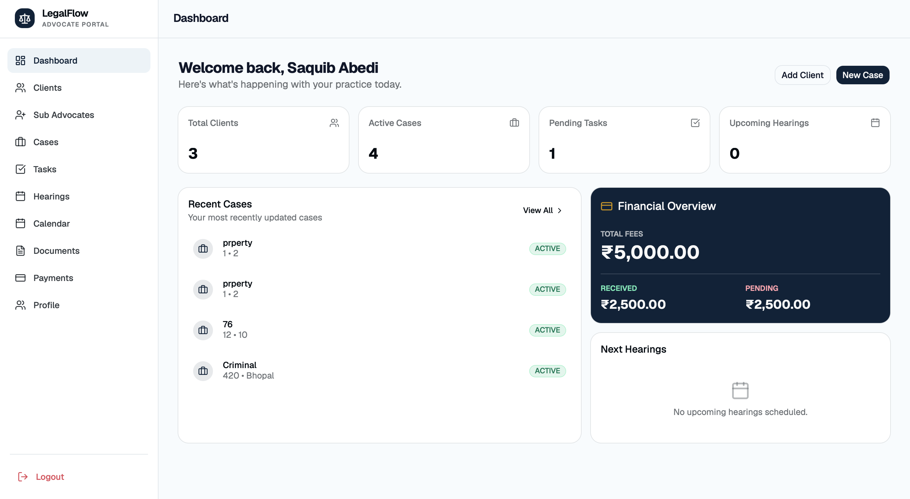
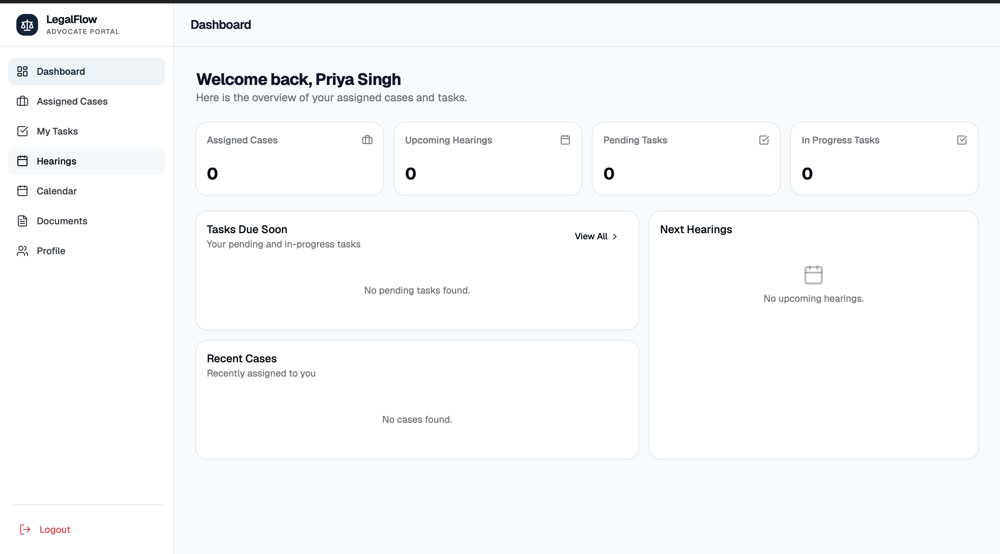
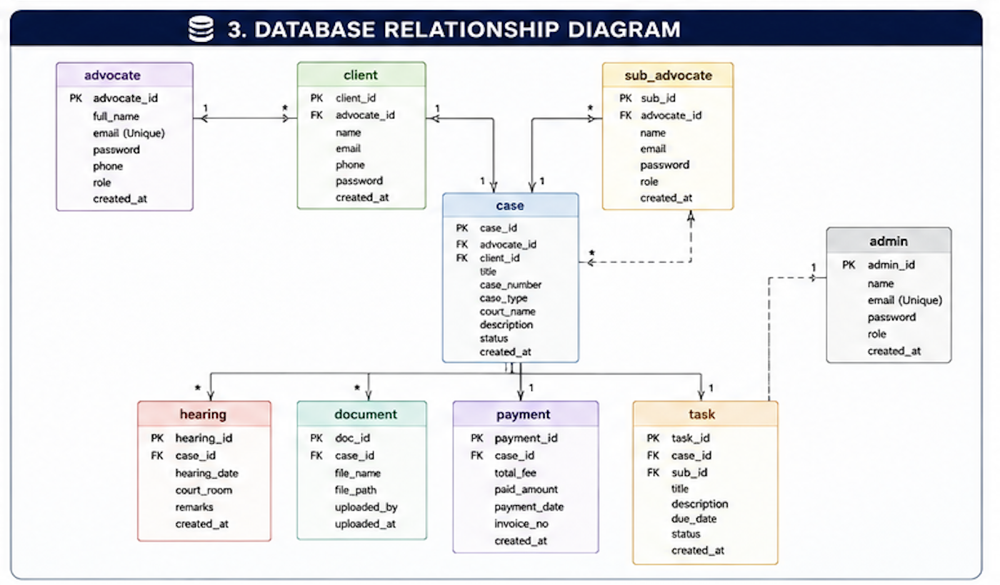

# ⚖️ LegalFlow

> **Modern Legal Practice Management Platform**

A modern full-stack legal practice management platform designed to streamline law firm operations through secure authentication, role-based access control, case management, hearing scheduling, document management, and invoicing.

> 🚧 **Project Status:** Under Active Development

  
  
  
  
  
  
  

 > **Note**
>
> This repository is a portfolio showcase for the LegalFlow project. It contains project documentation, UI previews, architecture diagrams, and application screenshots. The complete source code is not included in this public repository.

---

## 📑 Table of Contents

- [Overview](#-overview)
- [Live Demo](#-live-demo)
- [Project Showcase](#-project-showcase)
- [System Design](#-system-design)
- [Key Features](#-key-features)
- [Technology Stack](#-technology-stack)
- [Project Information](#-project-information)
- [Future Enhancements](#-future-enhancements)
- [Author](#-author)
---

## 📖 Overview

LegalFlow is a secure, scalable, and role-based legal practice management system built using modern Java backend technologies and a React frontend.

The platform enables advocates, sub-advocates, and clients to collaborate efficiently while maintaining secure access to legal information.
---
## 🌐 Live Demo

🚀 **Experience LegalFlow in action**

**Application:** https://YOUR-VERCEL-LINK.vercel.app

### Demo Accounts

| Role | Email | Password |
|------|-------|----------|
| 👨‍⚖️ Main Advocate | `saquib@gmail.com` | `12345` |
| 👨‍💼 Sub Advocate | `abdur@gmail.com` | `abdur@123` |
| 👤 Client | `sarim@gmail.com` | `sarim@123` |

> **Note:** LegalFlow is a role-based legal practice management platform. Each account provides a different dashboard and permissions based on the assigned role.

---

### ✨ Features Available in the Live Demo

- 🔐 JWT Authentication & Secure Login
- 👨‍⚖️ Main Advocate Dashboard
- 👨‍💼 Sub Advocate Dashboard
- 👤 Client Portal
- 📁 Case Management
- 📅 Hearing Scheduling
- 📄 Document Management
- 💰 Invoice & Payment Management
- 🔒 Role-Based Access Control

## 📸 Project Showcase

### Landing Page

---

### Application Preview

| Login | Advocate Dashboard |
|-------|--------------------|
|  |  |

| Sub-Advocate | Client Dashboard |
|--------------|------------------|
|  |  |

---

## 🏗️ System Design

### Entity Relationship (ER) Diagram

---

### System Architecture

---

### Database Relationship Diagram

---

### Project Folder Structure

---

## ✨ Key Features

- 🔐 JWT Authentication
- 🛡️ Role-Based Access Control (RBAC)
- 👨‍⚖️ Advocate Management
- 👥 Client Management
- 🤝 Sub-Advocate Management
- 📂 Case Management
- 📅 Hearing Scheduling
- 📄 Document Management
- 💳 Invoice & Payment Tracking
- 📡 RESTful API Architecture
- 📱 Responsive User Interface
---

## 🛠️ Technology Stack

| Category | Technologies |
|----------|--------------|
| **Backend** | Java 21, Spring Boot 3.5 |
| **Frontend** | React.js, HTML5, CSS3, JavaScript |
| **Database** | MySQL |
| **Authentication** | Spring Security, JWT |
| **ORM** | Spring Data JPA, Hibernate |
| **Build Tool** | Maven |
| **Testing** | Postman |
| **Version Control** | Git, GitHub |
| **IDE** | IntelliJ IDEA, VS Code |
---

## 📊 Project Information

| Category | Details |
|----------|---------|
| **Project Type** | Full-Stack Web Application |
| **Status** | Active Development |
| **Backend** | Spring Boot |
| **Frontend** | React |
| **Database** | MySQL |
| **Authentication** | JWT |
| **Build Tool** | Maven |
---
 
## 🔮 Future Enhancements

- Admin Dashboard
- Email Notifications
- Calendar Integration
- Cloud Deployment
- Analytics Dashboard
- Mobile Application
- Audit Logs
- Role Permission Management
---

## 👨‍💻 Author

**Syed Saquib Ali**

Java Full Stack Developer

📧 Email: saquibali516@gmail.com

🔗 GitHub: https://github.com/Saquibali46
